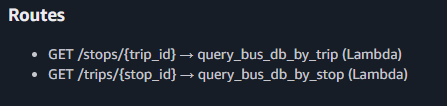
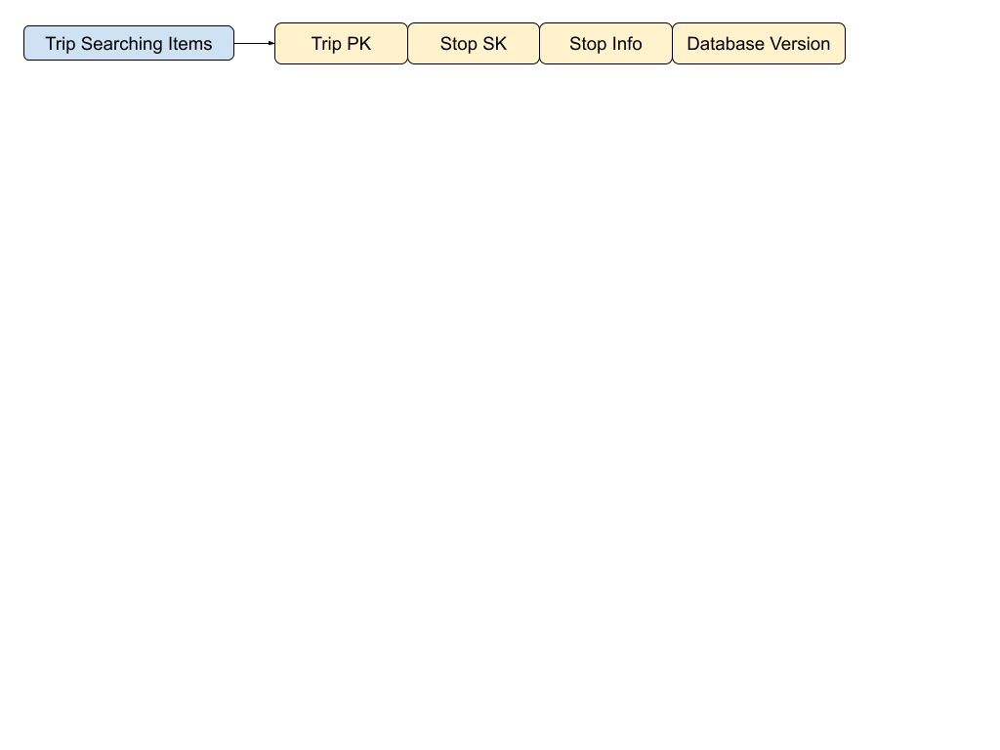
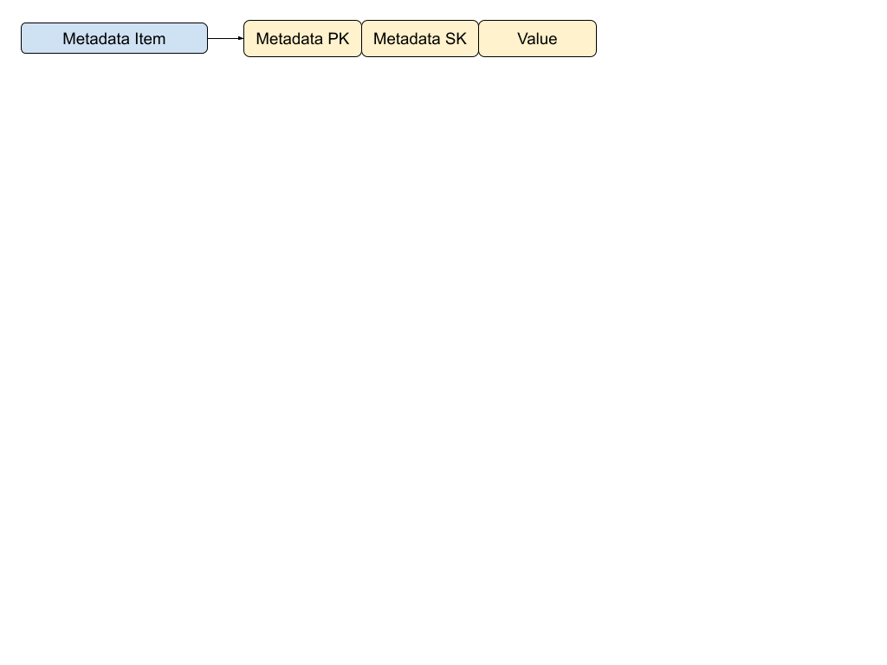
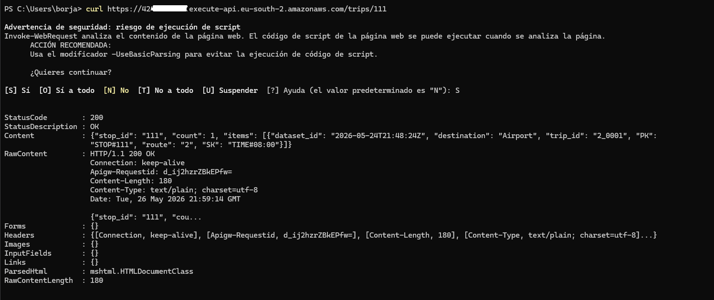
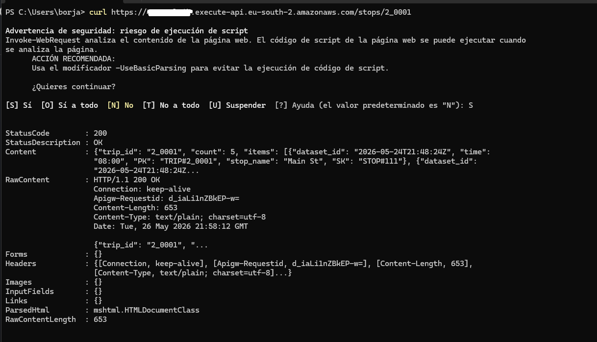
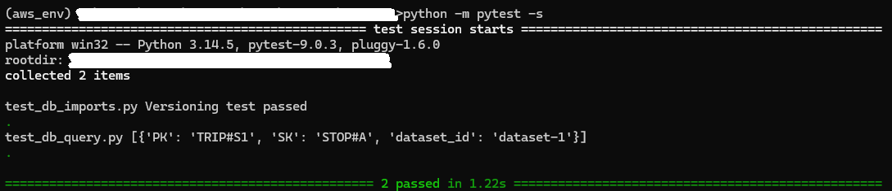

# AWS_bus_schedule_system

The project is a simple web service based on AWS serverless infrastructure. It stores bus 
schedules based on  a fictional city, and it allows users to make two types of queries: 

 - Query all trips (a fixed route at a given time) through a stop 
 - Query all stops for a given trip 

The outputs are HTTP responses with a status code and the output of the queries encoded 
in JSON format 

## Architecture Diagrams: 

### High level diagram 
The project is separated into two main processes. An admin can update the bus schedules stored in a database, and users can consult information about the schedules. 

 

### Service Diagrams: 

Since bus schedules and routes can often change, an admin can update the database  by uploading a json file into an S3 bucket. This triggers a Lambda function that will import the data of the json file into a DynamoDB database. 

 

The other process is based on user interaction through an HTTP API on API Gateway. The user will use an endpoint depending on which query he wants to make. This triggers an appropriate lambda function that queries the DynamoDB database, and returns data to the user. 

 

## HTTP API: 
The API routing structure was very simple, only two types of actions were needed 

## Database model:  

In DynamoDB, the database is designed around  
 
- Querying based on two types of keys: stops and trips. For efficiency, data was denormalized, matching DynamoDB patterns for filtering based on Partition Key.
- Being able to distinguish same routes at different times of the day  (A route at a specific time will be called a “trip”) 
- Having a schedule update system, that inside the database was achieved through version control 

This produced three types of items inside the database: 

In this simple case, the queries only involved the PK (Partition key).  
- If you use  the Trip PK as a filter, you get info on the different stops the trip contains.
- If you use the Stop PK as a filter, you can get info on the different routes that contain that stop. 
- If you update the database, a metadata item is generated/updated with a key indicating the latest database version.

## Motivation for the project: 
My main motivation was to learn the basics about some AWS services, in particular Lambda and  some form of backend (in this case, API Gateway).  
Since I had already used SQL, I also decided to take the opportunity and learn about a NoSQL alternative with DynamoDB. 

## Results:  
 
I could get the service running and make requests to the HTTP API from windows terminal using curl. This produced the expected results, obtaining info about the bus schedules within 
the database.
 
As the images below show , there is only one trip with the stop with id 111, and there were several stops associated with the trip with id 2_0001 

 
 
 
 ## Limitations and possible improvements:

 - Initially, there were unit tests using pytest and mocking AWS services, but the structure of lambda methods had to be modified for them to work as expected. For the scope of the project, it was not considered important enough to build new tests, but ideally it  would be done.

 - Database queries are very simple. Ideally more complex queries would be added, like filtering by time.
 - More effort should be put into security , like a better analysis of input requests, better control of incoming requests themselves with other tools like WAF
 - In case the ammount of request would increase, some form of cache should be implemented

 
 
 
 
